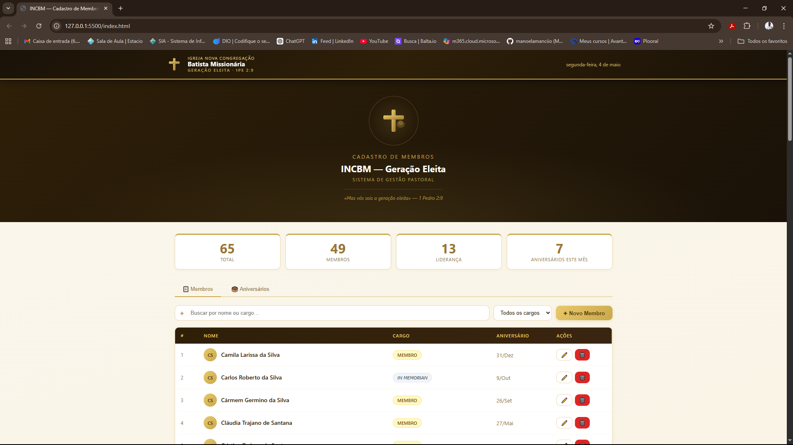
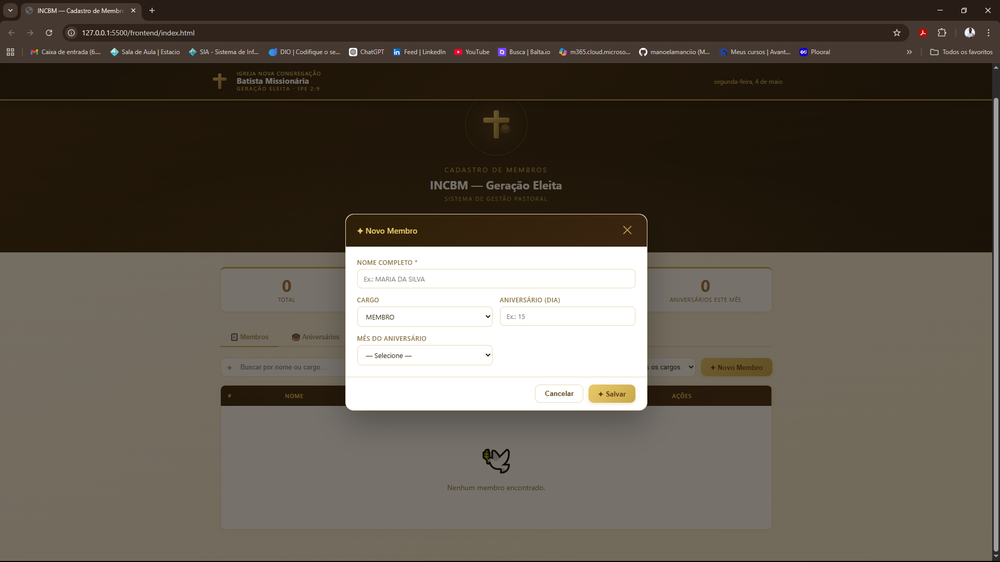
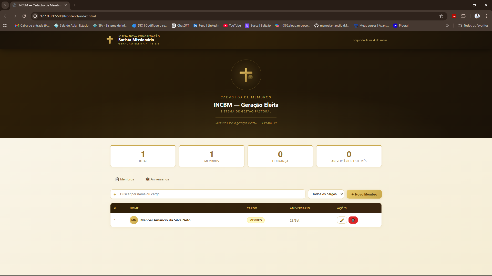

# 📊 Sistema de Gestão de Membros - Igreja

Sistema fullstack desenvolvido para gerenciamento de membros de igreja, permitindo controle completo de cadastro, edição, exclusão e visualização de membros e aniversariantes.

O projeto simula um sistema administrativo real, com integração entre frontend e backend através de API REST.

---

# 🎯 Objetivo

Este projeto foi desenvolvido com o objetivo de praticar desenvolvimento fullstack, abordando:

- Consumo de API REST
- CRUD completo (Create, Read, Update, Delete)
- Integração frontend + backend
- Manipulação de dados dinâmicos
- Organização de arquitetura web

---

# 🚀 Tecnologias Utilizadas

## Backend
- Java
- Spring Boot
- Spring Data JPA
- API REST
- Banco de dados H2 (em memória)

## Frontend
- HTML5
- CSS3
- JavaScript (Vanilla)
- Fetch API

---

# ⚙️ Funcionalidades

- 📋 Listagem de membros em tempo real
- ➕ Cadastro de novos membros
- ✏️ Edição de membros existentes
- ❌ Exclusão de membros
- 🔎 Filtro por nome e cargo
- 🎂 Lista de aniversariantes por mês
- 📊 Estatísticas gerais do sistema
- 🔄 Atualização dinâmica via API

---

# 🧠 Arquitetura do Sistema

Frontend (HTML / CSS / JavaScript)  
→ Fetch API (HTTP Requests)  
→ Backend (Spring Boot - API REST)  
→ Banco de Dados (H2)
---

# 🔗 Endpoints da API

| Método | Endpoint | Descrição |
|--------|----------|----------|
| GET    | /membros | Lista todos os membros |
| POST   | /membros | Cria um novo membro |
| PUT    | /membros/{id} | Atualiza um membro |
| DELETE | /membros/{id} | Remove um membro |

---

# ▶️ Como executar o projeto

## 🔧 Backend

Execute o projeto com:

```bash
mvn spring-boot:run
```

A aplicação estará disponível em:
http://localhost:8080

🌐 Frontend

Abra o arquivo:

frontend/index.html
📷 Screenshots

As imagens do sistema estão disponíveis na pasta:

/docs
Exemplo:

## 📊 Dashboard



## 🧾 Cadastro



## 📋 Lista



📈 Melhorias futuras
Sistema de login e autenticação
Migração para banco PostgreSQL
Deploy em nuvem (Render / Vercel)
Paginação de dados
Documentação da API com Swagger
Melhorias de UI/UX
🏁 Conclusão

Este projeto demonstra habilidades em desenvolvimento fullstack, integração de frontend com backend e construção de API REST, servindo como base para sistemas administrativos reais e portfólio profissional.


